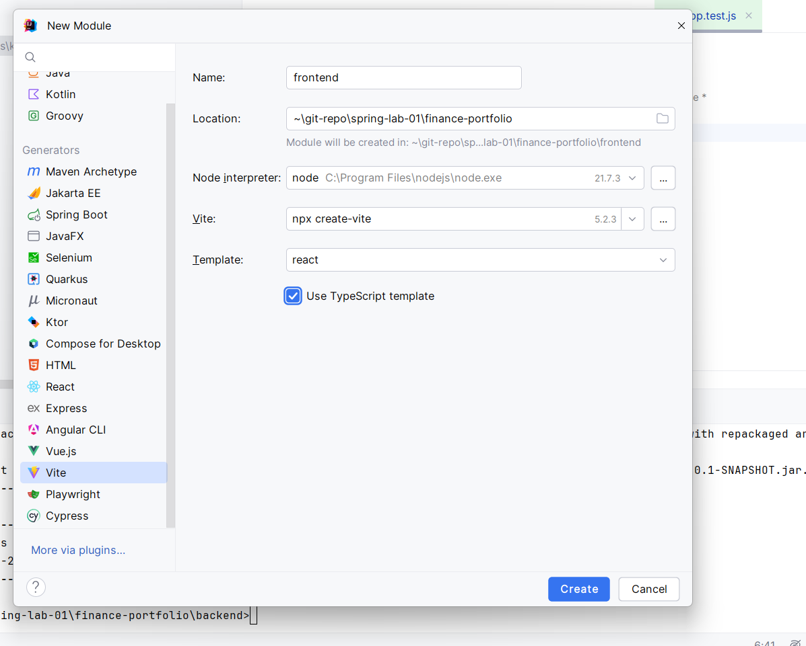

# Finance portfolio App 

1. User can create portfolios
2. User can have multiple portfolios
2. User can create/edit/delete accounts to a portfolio 
3. User can add balance to an account
4. User can see portfolio analytics on dashboard 

# Tech Stack
- Java 17
- Spring boot 3
- React

## Backend 
created from - https://start.spring.io/

## UI Details
- npm --version :  10.5.0
- node --version : v21.7.3

- Frontend using intellij - 

## Frontend references
 - https://mui.com/material-ui/getting-started/